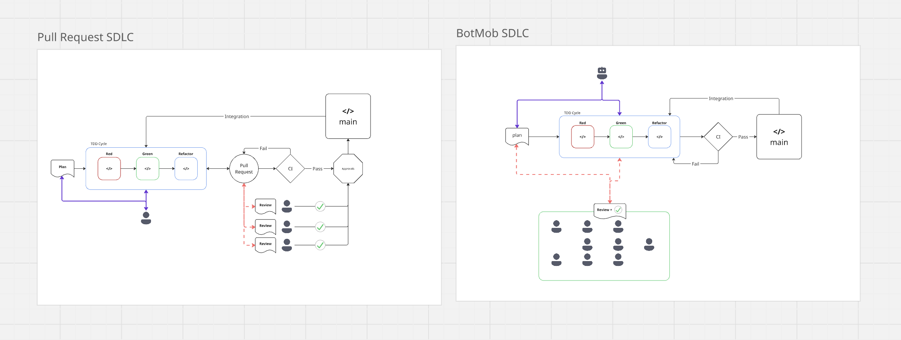

# ATC Tenets

This doc outlines what we believe ATC should be in the face of massive disruption to the estbalished SDLC by AI, Agents, and LLMS.

## Fundimental Truths
When setting out to disrupt it is important to agree on the things that can be taken for granted as facts.

### We believe it to be true that:

- Multiple skilled Engineers thinking about a problem together will always produce a higher quality output than a single Engineer (whole is greater than the sum of parts).
- Code socialization (ensuring that all of the team understands the current state of all of the code) is critical for reliability and speed to recovery during an incident.
- The "who" and "how" of code creation is irrelevent; only the quality and functionality of code matters.
- Individual code ownership is an antipattern that leads to key-man risks and knowledge silos, and should be avoided rather than encouraged.

## A Better SDLC For The AI Age
The big AI development challenge for 2026 is already taking form: "the review bottleneck." It goes something like this:
1. individuals can generate PRs at ridiculous speeds with help from AI tools like Claude Code
2. teams are then overwhelmed by all the PRs that need review
3. how can we unclog the review process?!?

The industry response seems to be dumping more AI on the problem; AI reviewing agents, AI PR summaries etc. But these won't work, because they don't solve the essential value of code review:
- diversifying views and inputs on how the problem is solved
- socializing code changes and understanding of the current state

So how do we solve the review bottleneck? **Our solution is to leverage an SDLC without code review** :mindblown:.

### Multiplayer From `git init`
[Pair programming](http://www.extremeprogramming.org/rules/pair.html) is a system where two developers author code together as a form of software development symbiosis. "Code review" happens as part of the development process, and as such there is no seperate review step in the lifecycle.
[Mob programming](https://agilealliance.org/resources/experience-reports/mob-programming-agile2014/) is pair programming on steroids. Entire teams of software developers collaborate on authoring the same code together. In this case both review and socialization (making sure the whole team understands the current state of the codebase) are baked into the development process, so no additional steps beyond the pairing process are needed.

Pair and mob have both traditionally required complex, dedicated hardware, and have had a steep learning curve associated with them; while it is generally agreed that these SDLCs produce the highest quality code, the difficulty in setup and overhead in implementation have kept them resserved largely to the most challenging problems.

In my personal experience, Mob is the "nuclear" option when all else has failed and a problem has reached critical mass; it has _always_ worked, but at the cost of halting the rest of the SDLC while the Mob is in session.

### Mob Is A Technical Challenge
Most of what is written on Mob programming focuses on the _technical how_: how to set up screens, who sits at the keyboard, how to coordinate instructions etc. The friction in Mob generally comes down to the limitations of the **driver**. If we had more, faster drivers, we could reduce that friction until the core bottleneck is essentially eliminated. Enter the AI Driver.

## AI Drives, Humans Think
By using _only_ AI Agents to drive the code development we are able to re-allocate human resources to the Mob "thinking pool"; human teams discuss and collectively improve the codebase without silos, getting the full value of diverse inputs while socializing the changes in real time. Every feature is the best of what the whole team has to offer, and everyone understands what has been done before the code is merged.

## BotMob

## Plan, Plan, Plan, Execute

## Can't stop, won't stop: DAG-like Approach to writing Code

## Human Instructions, not Actions

